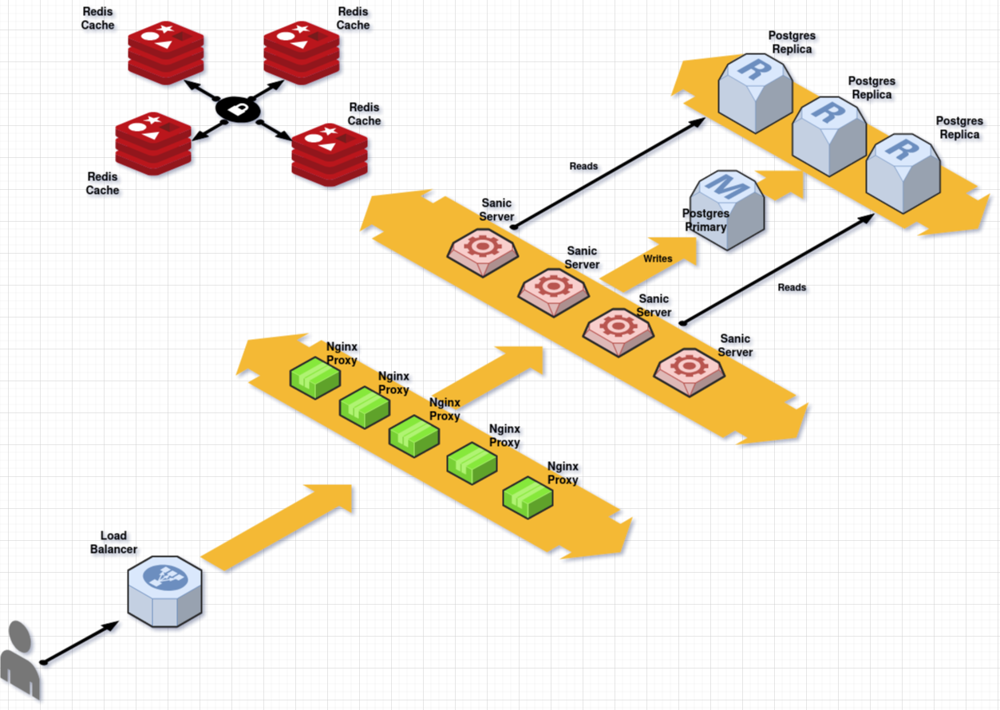

# Lea Record Shop

Feito com **Sanic Framework**, o mesmo utilizado no **Rasa Open Source**.

# Infraestrutura

Foi pensado uma infraestrutura modular e escalável com um banco de dados **Postgres** primário para escritas, e outro secundário apenas para leituras.

Todas as informações buscadas no banco de dados são cacheadas no **Redis**, podendo mais tarde crescer o número de nós no cluster, de acordo com as necessidades do momento.

O **Sanic Framework** faz o principal trabalho lógico de busca nos bancos, modelagem de dados e cacheamento. Com esta configuração, ele pode ser escalonado segundo a demanda.

À frente temos o **Nginx** funcionando como um Proxy Reverso, aumentando ainda mais a capacidade de carga que esse sistema pode suportar.

# Tecnologias usadas

Usamos as seguintes tecnologias para suportar cargas imensas de fluxo de usuários:

|                |Tecnologia                     |Motivo                         |
|----------------|-------------------------------|-----------------------------|
|Banco de dados  |`Postgres`                     |'O ecosistema Python é familiarizado com ele.'|
|Framework       |`Sanic Framework  `            |'Ele é utilizado internamente pelo Rasa. É de suma importancia conhecê-lo.'|
|Cache           |`Redis`|'O Redis é um banco de dados in-memory super rápido e escalonável, podendo criar clusters.'|

Com essas três tecnologias básicas, pudemos criar um sistema robusto e escalonável na infraestrutura, e igualmente simples na lógica de programação, demandando poucas manutenções e débitos técnicos

# TODO (à fazer)

Neste projeto não foi desenvolvido o filtro da API de discos, pois demandaria outras tecnologias de busca, como o ElastiCache, já que qualquer **SELECT** específicio no banco de dados pode prejudicar a performance.

Ficamos satisfeitos em deixar a responsabilidade de quaisquer tipos de buscas/filtros com algum sistema de front end, deixando o back end aqui citado apenas para o foco do objetivo.

# Como rodar o ambiente?

Será necessário apenas ter Docker e Docker Compose no sistema. Baixar o repositório e rodar o seguinte comando:

`docker compose up`

Isso criará um endpoint em **[localhost](http://127.0.0.1)** na porta **80**, que dá acesso ao Proxy Reverso (Nginx)

# Comandos e API

Abaixo tem alguns comandos via console de CRUD para discos, clientes e pedidos:

> Adicionar um disco novo no sistema

`curl http://127.0.0.1/disc --data '{"name":"A","artist":"A","lauched":"2023","style":"rock","quantity":"10"}'`

> Mostra todos os discos ativos no sistema
>
`curl http://127.0.0.1/discs`

> Mostra um disco específico, pelo ID
>
`curl http://127.0.0.1/disc/1`

> Apaga um disco do sistema
>
`curl http://127.0.0.1/disc/1 --request "DELETE"`

`curl http://127.0.0.1/client --data '{"name":"John Doe","document":"0001","birthdate":"12/31/2000","email":"john-doe@example.com","phone":"555-1234"}'`
`curl http://127.0.0.1/clients`
`curl http://127.0.0.1/client/1`
`curl http://127.0.0.1/client/1 --request "DELETE"`

`curl http://127.0.0.1/order --data '{"client_id":"1","disc_id":"1","quantity":"1"}'`